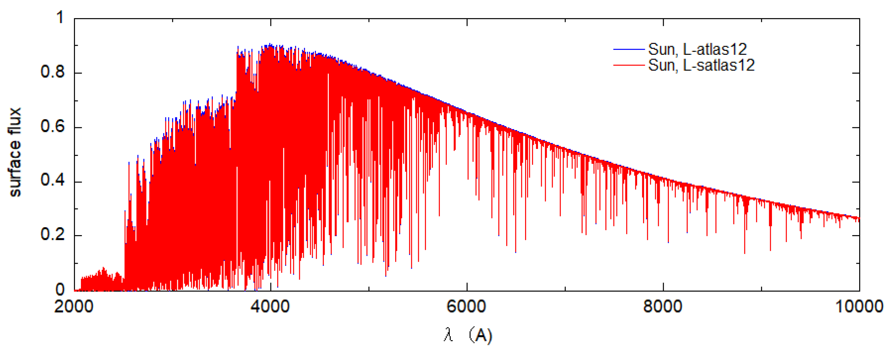
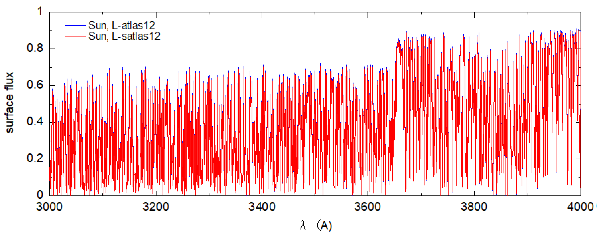
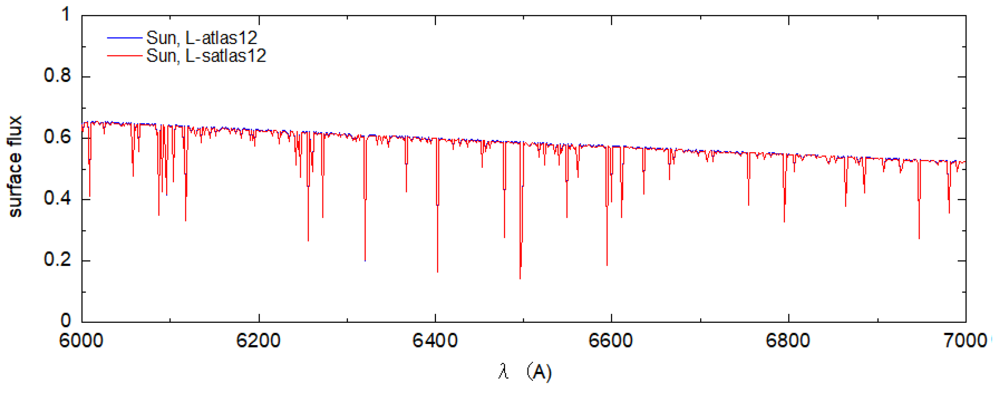
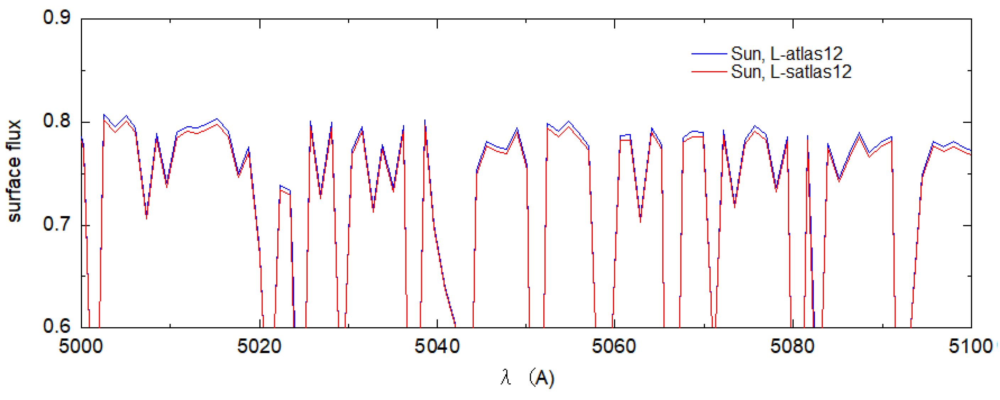
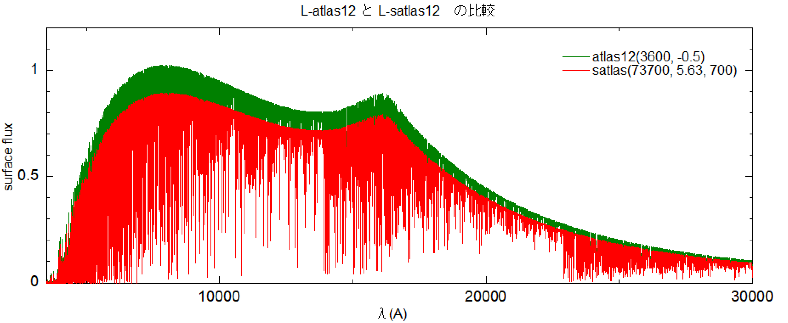
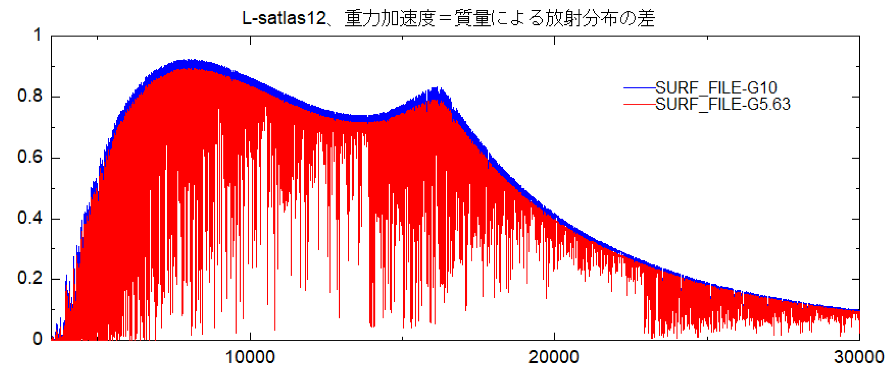
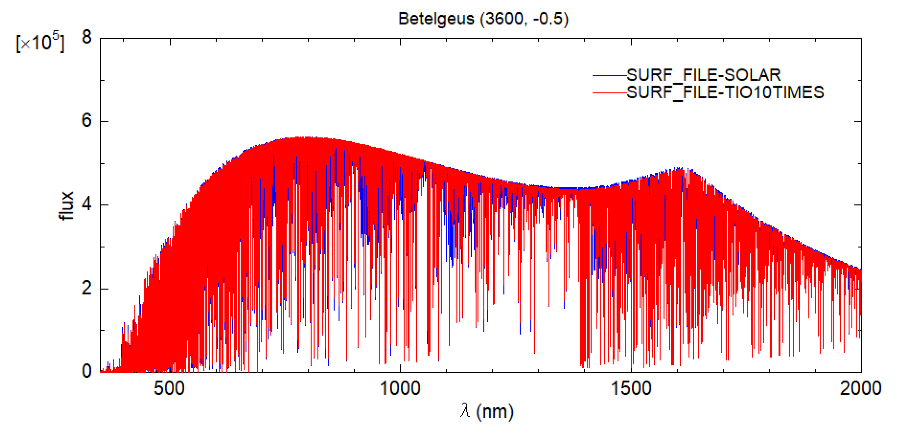

# On the Spherical Stellar Atmosphere Modeling Program L-satlas

Seigakukan – Ken'ichi Kato

2023.3.19

## Abstract

This report introduces calculation examples produced with L-satlas12, the spherical-atmosphere extension of the stellar atmosphere modeling program.
By comparing its results with the observed spectrum of Betelgeuse, we examine its characteristics.

## 1. Introduction

The stellar-atmosphere modeling program ATLAS12 was developed by R. L. Kurucz at the Harvard-Smithsonian Center for Astrophysics. 
Since then, it has been modified and improved by multiple researchers. 
Some of these features have been introduced previously at this Astronomical Data Center (see "Lester version of ATLAS12 (L-ATLAS12)").

The version rewritten by J. Lester and colleagues at the University of Toronto introduces a one-dimensional spherical stellar atmosphere model, extending the code far beyond a simple modification. 
A natural question is how much this new spherical model differs from the classical plane-parallel ATLAS12 results.

If the differences are significant, then for supergiants such as Betelgeuse whose extended geometrical structure cannot be ignored, the spherical code satlas12 should be used. 
For this reason, I ran both the Lester versions of atlas12 and satlas12 and compared the results.

Many of their key characteristics are already described in Lester & Neilson (2008). 
The present report simply summarizes what I obtained by actually running the codes.

## 2. Structure, Usage, and Behavior of L-satlas12

Since the fundamental structure is the same as L-atlas12, it is best to refer to "Lester version of ATLAS12 (L-ATLAS12)". 
The only difference lies in the program executable; all modules and line-data sets are identical, and the two required input files have the same names. 
However, the contents of the input file differ slightly, and are as follows:

```
# Betelgeuse
read pp_in
luminosity 73700.0
mass 10.0
radius 700.0
#read sp_in
abundance change 26 -4.59
read lines
molecules on
#surface intensity 12 1.0 0.9 0.8 0.7 0.6 0.5 0.4 0.3 0.2 0.1 0.05 0.01
#surface intensity

# SUN
iterations 15
print         1 0 0 0 0 0 0 0 0 0 0 0 0 0 1 0 0 0 0 2 0 0 0 0 1 0 0 0 0 1
punch         0 0 0 0 0 0 0 0 0 0 0 0 0 0 1 0 0 0 0 1 0 0 0 0 0 0 0 0 0 0
surface flux  0 0 0 0 0 0 0 0 0 0 0 0 0 0 1 0 0 0 0 1 0 0 0 0 0 0 0 0 0 0
begin
end
```

In atlas12, the atmospheric parameters are specified using (effective temperature, surface gravity).
In L-satlas12, this is replaced with (luminosity, mass, radius).

Place all relevant files in the same folder and execute `L-satlas_os.x`.

At present, I run the code on two different PCs. 
One of them is too slow to be practical.
Table 1 summarizes the current machine specs.
Machine No. 2 is a low-end portable model from Mouse Computer; it performs adequately for normal tasks but reveals strong limitations in heavy numerical computations. 
The CPU clock speed directly correlates to computation time.

The calculation times are shown below.
L-atlas12 finishes within 5–6 minutes, whereas L-satlas12 requires about 15 times longer.
Since the atmospheric parameters differ only slightly, the longer runtime is likely due not to opacity sources but to the temperature correction procedure, which appears to take significantly more time in L-satlas12.

Table 1. Computer Models and Performance
- No. 1
    - Epson AT993E (“Endeavour”) – about 80 minutes for 15 iterations
    - Intel i7-6700 CPU 3.40 GHz
    - RAM 16 GB
    - Windows 10 Home + VMware Player 16 + Ubuntu 14.04
- No. 2
    - Mouse DESKTOP-G1SLF4K – 3–4 times slower than the Epson machine
    - Intel Celeron N4100 CPU 1.10 GHz
    - RAM 8 GB
    - Windows 10 Home + VMware Player 15 + Ubuntu 14.04

## 3. Windows + gFortran Does Not Work

I initially thought that running the program with gFortran on Windows would be convenient. 
I applied several modifications so that the source could be compiled. 
Although compilation succeeded, the executable stopped partway through the calculation on both PCs. 
This occurred for both L-atlas12 and L-satlas12, and under both Windows and Ubuntu.

This suggests the resulting code was not functioning properly.
gFortran is an excellent compiler, and successful ATLAS runs have been reported for other variants, but it does not appear compatible with the Lester version.

The working executables used here were therefore compiled with the Intel Fortran Compiler.

## 4. Comparison of L-atlas and L-satlas Results

### 1) The Sun

As a standard reference, I computed models for the Sun using both codes.
The results (Figures 1-3) show no noticeable differences.
Figure 4 zooms in on the region around 5000 Å, where slight deviations might appear. The spherical model produces only a very small reduction. At the line around 5047.5 Å, the difference is roughly 0.005, corresponding to about 0.6%.


*Figure 1. Comparison of radiation distributions computed by the two codes (1)*


*Figure 2. Comparison of radiation distributions computed by the two codes (2)*


*Figure 3. Comparison of radiation distributions computed by the two codes (3)*


*Figure 4. Comparison of radiation distributions computed by the two codes (4)*

Whether this difference is truly due to the spherical geometry, or arises from increased code complexity and associated numerical issues, cannot be determined here. For now, we may conclude:

> For the Sun, spherical geometry produces differences of at most ~0.6% depending on wavelength.

#### Total flux

- For atlas12: 6.3288 × 10⁷ W/m²
- For satlas12: 6.310 × 10⁷ – 6.329 × 10⁷ W/m² (depending on depth)

Although differences appear at certain wavelengths, the integrated fluxes agree well, suggesting that deviations in different regions cancel out globally.

From the Stefan-Boltzmann law, the solar flux is 7.94 × 10⁸ W/m².

### 2) Betelgeuse

Assuming Betelgeuse parameters, I used:

- L-atlas: (Teff, log g) = (3600 K, −0.5)
- L-satlas: (luminosity, mass, radius) = (73700, 5.63 M⊙, 700 R⊙)

These represent nearly equivalent atmospheric parameters.
Lester & Neilson (2008, section 4) computed similar models and reported almost no structural differences.
Thus, one expects similar emergent radiation. 
Here I compare actual results.


*Figure 5. Comparison of emergent radiation from Betelgeuse using L-atlas12 and L-satlas12*

Using Stefan-Boltzmann's law of $L=4\pi R^2 \sigma T_e^4$ and gravity $g = \frac{G M}{R^{2}}$
, with ⭑ for the star and s for the Sun:

$$
\frac{L_\ast}{L_s}
  = \left(\frac{R_\ast}{R_s}\right)^2
    \left(\frac{T_\ast}{T_s}\right)^4
$$

$$
\frac{L_\ast}{L_s}
  = \left(\frac{R_\ast}{R_s}\right)^2
    \left(\frac{T_\ast}{T_s}\right)^4
$$


Taking T=5780 K and logg=4.44, the parameters are indeed equivalent.

From Figure 5, L-atlas gives a slightly larger total flux.
Absorption in the UV region becomes extremely strong below ~2700 Å, so radiation there is negligible; the figure therefore essentially shows the total flux.

#### Total flux

Surprisingly, both models yield values close to the blackbody flux:
- Blackbody: 9.53 × 10⁶ W/m²
- L-atlas12: 9.5240 × 10⁶ W/m²
- L-satlas12: (8.427–9.858) × 10⁶ W/m²

This is curious, because substantial discrepancies were found for the Sun.

#### Effect of gracity (Mass)

I compared results for masses 5.63 M⊙ (the baseline case) and 10.0 M⊙ while keeping the same radius.
Larger mass increases surface gravity.


*Figure 6. Comparison of radiation distributions for different masses (gravity effect)*

#### Effect of Elemental Abundances

Betelgeuse shows strong TiO band absorption, which dominates its spectrum.
I tested whether increasing the abundances would drastically change the continuum.
Using L-atlas12, I increased O and Ti abundances by a factor of 10.
When increased by a factor of 100, the calculation failed: the array P_TAB exceeded its 9000-element limit.


*Figure 7. Effect of elemental abundances. The case with O and Ti increased by ×10 is shown in red.*

Figure 7 shows that ×10 enhancements do not significantly affect the continuum distribution.

## References
Lester, J. B., & Neilson, H. R. 2008, A&A, 491, 633.