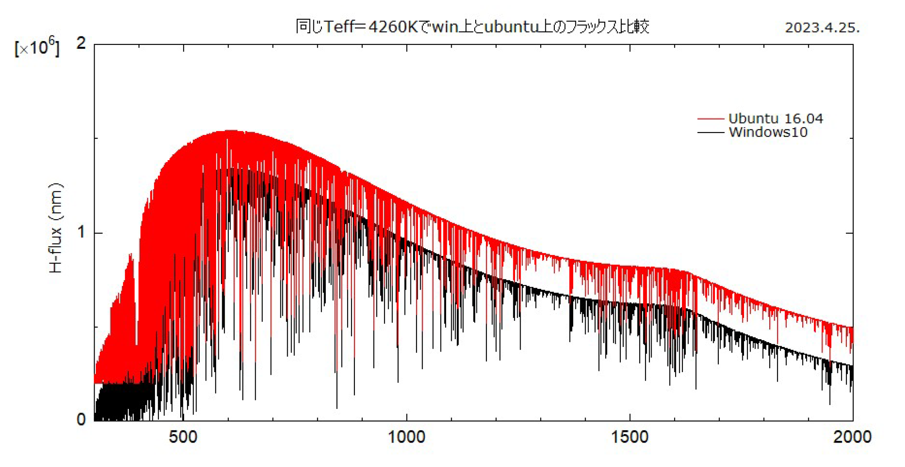
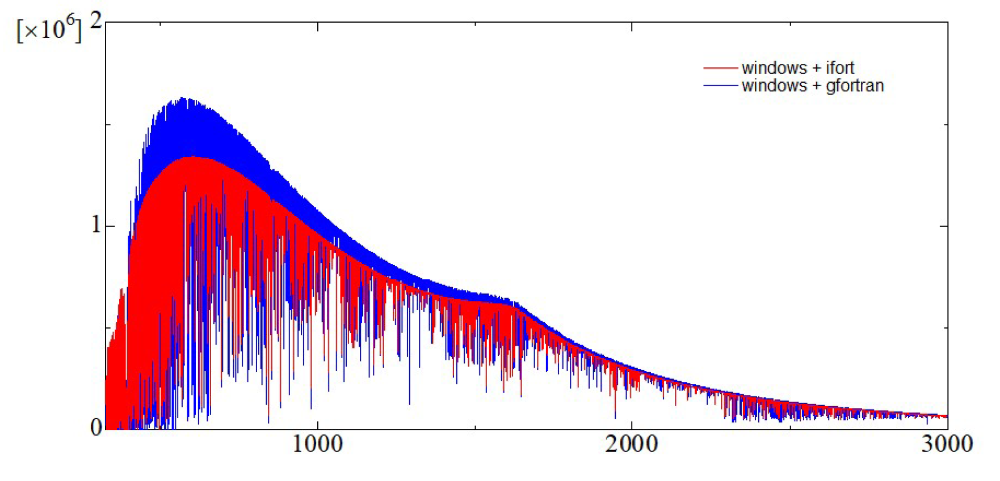
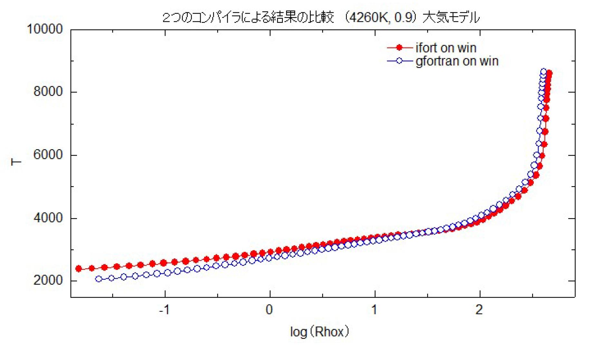
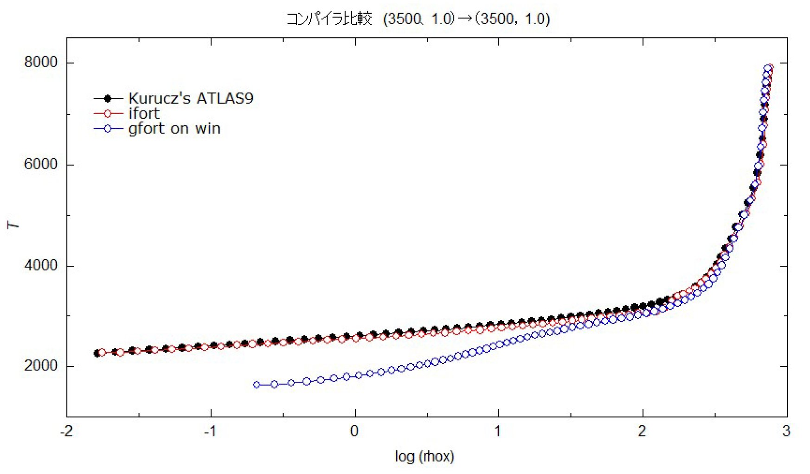
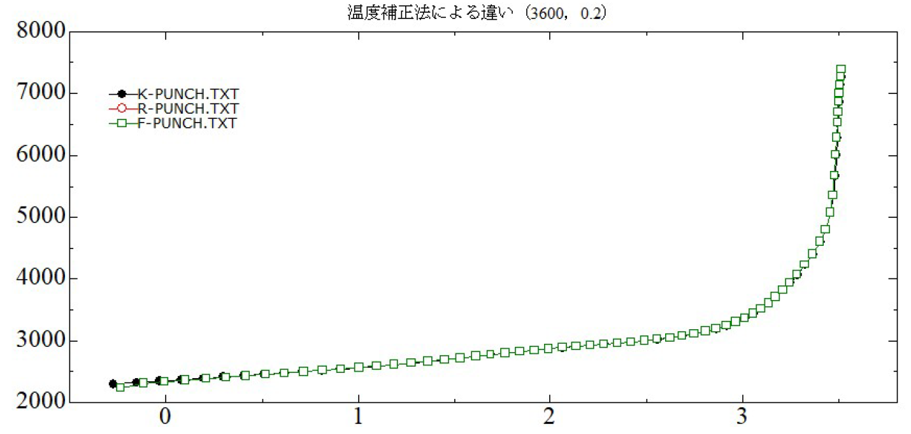
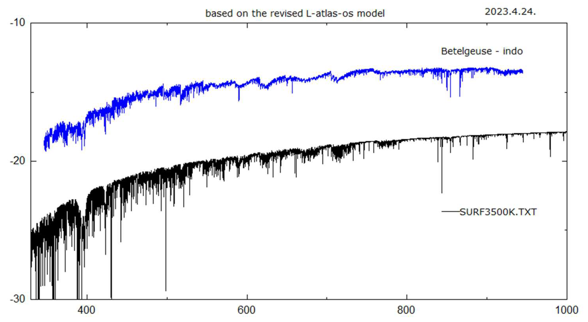

# Lester version of ATLAS12 (L-ATLAS12)

Seigakukan – Ken'ichi Kato

V. 2017.3.18. 
V. 2023.6.19.

## 1. Overview and the work done this time
### Lester & Neilson (2008) atlas_os

The stellar-atmosphere models ATLAS9 and ATLAS12 by Kurucz (http://kurucz.harvard.edu/) were rewritten by Lester & Neilson (2008, http://www.astro.utoronto.ca/~lester/) into atlas_odf and atlas_os in accordance with Fortran 2003. These are new versions of ATLAS9 and ATLAS12 that support modern Fortran compilers. There are also revisions of Kurucz's original programs by Castelli (http://wwwuser.oats.inaf.it/castelli/) and by Bischof (Katharina M. Bischof, Institute for Astronomy, Vienna) adapted to Fortran 77, but all of these can no longer be compiled with the latest gfortran or Intel Fortran compilers, which makes the Lester versions especially valuable. Moreover, Lester and colleagues did more than merely make the code Fortran 2003–compatible: they proactively rewrote it throughout to match the new syntax, resulting in a rigorously structured program with greatly improved reliability.

In addition, S-ATLAS9 and S-ATLAS12, which extend ATLAS9/12 to spherical atmospheres, as well as the SYNTHE spectral-synthesis package, are bundled together. As an extended, modernized edition of the ATLAS models, this can be regarded as the current definitive version.

### Bugs and fixes in L-ATLAS12

In what follows, the ATLAS12 stellar-atmosphere code rewritten by Lester & Neilson will be referred to as L-ATLAS12.

Thought being refereed as definitive version, the source programs released by Lester contain bugs and will not compile as is. In fact, back in 2015 they could be compiled and run with Intel Fortran without any modifications; however, when we switched to the 2023 Intel Fortran compiler, compilation failed. The same occurred with gfortran: the latest gfortran compiler also failed to compile the code. These bugs were uncovered by the stricter syntax checking in newer compilers, but some are logical errors, and some are proved to be dangerous.

There were also simple but dangerous errors introduced when rewriting from the original source that a compiler would not catch. For example, in the `subroutine xlinop`, a `rewind 19` statement was missing. As a result, during successive iterations from the second pass onward, the light-element line data including hydrogen were not read, and the final results lacked the influence of hydrogen and related species. Since we did not conduct a comprehensive review of all source files this time, we must be prepared for the possibility that such defects still remain. That said, for the purpose of constructing atmospheric models, there does not appear to be a large difference in the temperature-pressure structure, so this is likely not a major concern for ordinary use.

The types of bugs and our responses are summarized in Table 1.

In addition, there are numerous locations where the compiler issues warnings; many of these remain.

*Table 1. Bugs and Their Fixes*
|Location of bug | Description | Fix |
|:----:|:----:|:----:|
| `sub xlinop`| When reading the light-element line data `nltelines.bin`, the command to reset the file pointer to the beginning (`rewind 19`) was missing. This is a fatal error caused by an oversight during the rewrite. | Insert `rewind 19` before `read(19)`.|
| `sub xlinop` (`if (iw<1 .or. waveset(iw)<wcon)`)   | If `iw < 1`, then `waveset(iw)` triggers an out-of-bounds access, making the `if` statement itself erroneous. (It compiled in 2015.)|Split the logic into **two** separate `if` statements.|
| `sub xlinop` (`do … if(iw < max(nu - i, 1)) exit`) | The loop variable `i` is **undefined** here. (It compiled in 2015, but `i` was indeterminate—indeed an error, due to an oversight during the rewrite.)| Replace with `do i = 1, 2000`, following Kurucz’s original.|
| `sub josh_r` (`do i_mu = 1, n_mu`)  | `i_mu` is **defined twice**. (It compiled in 2015.) Note `i_mu` is already used as an array index in `arr_t1u(ij, 1:ndepth, i_mu)`.|  Rename the loop index to `k_mu`.|
| `fun mapcs` | Initialization error for `n_last`. In 2015 it compiled, but `n_last` was uninitialized (compiler gave 0), and it was then used as an array index, causing an error.   | Initialize with `n_last = 81`.|
| `sub solvit`| `intent(inout) :: b(:)` causes an error. (It compiled in 2015.)|Change to `intent(out) :: b(:)`.|
| `sub si2op` | Initialization error for `index_t(ij)`, same kind of mistake as with `n_last`.|Properly initialize `index_t(ij)` before use (apply the same remedy as for `n_last`).|
| `sub josh`  | `knu(1) = sum(ck(1:nxtau) * xs(1:ndepth))` may cause out-of-bounds access (though it compiles).|Use `xs(1:nxtau)` instead of `xs(1:ndepth)`.   |

### Handling of the light-element line data file nltelines.bin

An important file, `nltelines.bin`, stores the data for the following elements:
HI, HeI, HeII, CI, CII, OI, NaI, MgI, MgII, AlI, SiI, SiII, KI, CaI, CaII.
The original source is `nltelines.asc`.

1. Conversion program

Kurucz instructs that the original data `nltelines.asc` be converted to a binary file using `rnlte.for` or `rnlteall.for`. However, these require other, unexplained data files, so conversion cannot be done as is. Therefore, it is better to use Castelli's `nltelinesasctobin.for`.

2. The tangled situation with binary data files

In ATLAS12, `nltelines.bin` is read as follows:

```for
DO 900 LINE=1,100000
READ(19,END=901) WLVAC, ELO, GF, NBLO, NBUP, NELION, TYPE, NCON, NELIONX,
&                  GAMMAR, GAMMAS, GAMMAW, IWL
```
By contrast, `rnlte.for` and `nltelinesasctobin.for` write the binary data like this:

```for
1253 write(19) wlvac, elo, gf, nblo, nbup, nelion, type, ncon, nelionx,
&               gammar, gammas, gammaw, nbuff, lim
```

The last two fields differ, so if you use an · created this way with ATLAS12, it will naturally produce an error. You should be cautious with the binary files provided by Kurucz and Castelli.

3. Adopting the ASCII file gfnlte.asc
Because the contents of a binary file are not easy to inspect, it is difficult to immediately judge whether it is compatible with ATLAS12. Therefore, in this work we converted it to ASCII so the contents can be checked at a glance, named it gfnlte.asc, and made it compatible with ATLAS12 by using only `nbuff` for the final `IWL` field.

## Integration of source files and compilation method

Lester's distribution consists of 44 modules and 8 main programs, for a total of 52 separate source files. Since this is cumbersome to handle, I merged them into two files:

1. `1.module.for`
2. `2.programs.for`

When enabling debug options, I used the following settings:

```bash
ifort -qmkl -check all -gen_interfaces -fpe0 -ftrapuv -traceback -o L-atlas12.exe \
  1.module.f 2.programs.f
```

In compilation with Windows ifort, the syntax checking appears stricter than with Linux ifort. It flagged inconsistencies related to `intent` attributes; after fixing those, the code compiled. For this release, however, I am attaching only the executable built on Linux/Ubuntu; the Windows version is omitted.

## 2. System setup and test results

### System and compiler

#### 1) OS and compiler

We used Linux (Ubuntu 16.04) as the OS. Windows 10 also works, but runtime was more than three times longer than on Ubuntu, so we chose Ubuntu.

The compiler was Intel Fortran (ifort), version 2021.8.0. For a while only a paid edition was available, but a free edition has recently become available again.

Installation of ifort failed on Ubuntu 14 and Ubuntu 18. On the latest Ubuntu 22, ifort is compatible, but the environment is stricter and less convenient than Ubuntu 16, and file exchange with Windows is not as straightforward; therefore we adopted Ubuntu 16.

With gfortran, the L-ATLAS12 sources (which compile with ifort) could not be compiled. This appears to be because gfortran handles variables more strictly and does not accept certain implicit assumptions that ifort treats as tacitly allowed, requiring more careful treatment.

```
Linux: Ubuntu 16.04 LTS
ifort / Linux installers: l_BaseKit_p_2023.0.0.25537.sh, l_HPCKit_p_2023.0.0.25400.sh

ifort / Windows 10: visual_studio_2019, w_BaseKit_p_2023.0.0.25940.exe, w_HPCKit_p_2023.0.0.25931.exe
```

#### 2) Hardware

My setup is as follows:

```
Epson AT993E (product name: Endeavor) — Intel i7-6700 CPU @ 3.40 GHz, 16 GB RAM

Windows 10 Home + VMware Player 16 + Ubuntu 16.04
```

The runtime for 15 iterative approximations using the above system is summarized in Table 2.

*Table 2. Runtime comparison — on Ubuntu vs Windows*
| Model (Teff, log g) | Ubuntu ifort| (debug mode) [min] | Windows ifort [min] |
| ------------------- | -------------:|-----------------: | ------------------: |
| 3000 K, +0.0        |       4.5 |                  ||
| 4260 K, +0.9        |                             2.0 |    |            14.4 |
| 10000 K, +4.0       |                             1.7 |                 9.8 ||
| 20300 K, +2.7       |                             1.7 |                    ||

#### 3) On the calculation results

Figure 1 shows the results on Ubuntu and on Windows (flux per nm). There is no difference between the two sets of results, but as shown in Table 2, the computation time on Windows was seven times longer.


*Figure 1. Flux comparison between Windows and Ubuntu at Teff = 4260 K*

### Inappropriate behavior with gfortran

Although we did not adopt gfortran in this work, the Windows version can compile and run the source programs here. In other words, despite sharing the "gfortran" name, the Linux and Windows gfortran compilers differ substantially and should be regarded as separate beasts.

As shown below, the results from Windows gfortran differ from those of ifort and deviate from past ATLAS9 results, suggesting that it produced incorrect code. For this reason, we did not use gfortran here.

|              | Windows 10               | Linux     |
| :------------: | :------------------------: | :---------: |
| ifort    | ○ (OK)                   | ○ (OK)    |
| gfortran | △ (runs but problematic) | × (fails) |

Using the same source program and the same atmospheric parameters, when we compare results computed with ifort and gfortran, we find clear discrepancies, as shown in Figures 2 and 3 below.


*Figure 2. Compiler-dependent differences (1): flux at 4260 K.*


*Figure 3. Compiler-dependent differences (2): temperature structure at 4260 K.*

Up to this point it's hard to judge which is superior, so I computed the same (3500 K, log g = 1.0) model with both ifort and gfortran, starting from an ATLAS9 (3500 K, 1.0) model. The results are shown in Figure 4. The ifort result closely resembles the original data, whereas the gfortran result deviates severely from both. The divergence is especially large in the line-forming layers, which suggests that the flux will also differ significantly. Given that these calculations use the same parameters, such a large departure from the original ATLAS9 model is unlikely, so we conclude that the gfortran computation was not appropriate.

Whether this is merely due to differences in the execution environment, or whether logical errors remain even though it compiles (or something else) remains unclear.

Note that I single out gfortran here because, in the Castelli and Bischof versions, compilation with gfortran is treated on a par with ifort.


*Figure 4. Compiler-dependent differences (3): temperature structure at 3500 K.*

## 3. How to run

### Procedure
Create a working folder on Ubuntu, place the following files in it, and run:

```
# ./L-atlas12.exe
```

Required files

- L-atlas12.exe
- Line data listed in Table 3
- Molecular data: molecules.dat
- Initial value files: input.dat, model.dat

### Spectral line data
Below is a summary of the line data used by ATLAS12.

*Table 3. Line data used in ATLAS12 (see table for details).*
| Name          | Contents                                                                                          | Number of lines |   Size |
| ------------- | ------------------------------------------------------------------------------------------------- | --------------: | -----: |
| gfnlte.asc    | HI, HeI, HeII, CI, CII, OI, NaI, MgI, MgII, AlI, SiI, SiII, KI, CaI, CaII                         |          38,298 |   4 MB |
| lowlines.bin  | Lines of ions for all elements except those handled in gfnlte.asc, up to the 4th ionization stage |       7,915,144 | 494 MB |
| highlines.bin |  |       2,566,183 | 160 MB |
| diatomic.bin  | Lines of diatomic molecules | 1,975,559 | 123 MB |
| tiolines.bin  | TiO lines |       9,436,125 | 590 MB |
| h2o.bin       | H2O lines |      16,478,089 | 515 MB |

### File list (excluding line data)

Depending on the options set in input.dat, several files and intermediate files are created.
The intermediate files are deleted at the end of the calculation.

*Table 3. *Table 3. Line data used in ATLAS12 (see table for details).*
|Type|Name|Purpose etc|Size etc|
|:--:|:--:|:--:|:--:|
|Executable program|L-atlas12.exe|Executable file|2.5 MB|
|Molecular line data|molecules.dat|||
|Input data|input.dat|Parameters for input/output||
|Input data|model.dat|Initial atmospheric model to start from.|Use an ATLAS9 model, etc., whose Teff, log g, and other parameters are close to the model you intend to compute.|
|Output data|print.txt|Intermediate progress of the calculation, etc.||
|Output data|punch.txt|Computed atmospheric model||
|Output data|surf.txt|Created depending on the options in input.dat||

### Parameters for input.dat and how to set them

Many parameters are available, but since I have not tried most of them, I do not fully understand their actual behavior.

Please refer to the following manuals:
- Kurucz, R. L. 1970, "ATLAS: A computer program for calculating model stellar atmospheres", SAO Special Report No. 309 (available from Kurucz’s homepage http://kurucz.harvard.edu/)
- Castelli, F. 1988, "Kurucz's models, Kurucz's fluxes and the ATLAS code. Models and fluxes available at OAT",Osservatorio Astronomico di Trieste Pubblicazione No. 1164 (available from Castelli’s homepage https://wwwuser.oats.inaf.it/castelli/)

### Three types of temperature-correction routines

Three schemes for temperature correction are provided and can be selected via directives in `input.dat`.
They are the Kurucz scheme, the Feautrier scheme, and the Rybicki scheme.
If you comment out the following lines by placing a “#” at the beginning, the Kurucz scheme is used:

```
#josh feautrier
#josh rybicki
```

For the (3600 K, 0.2) model, the execution times were 3.8 minutes, 2.9 minutes, and 82 minutes, respectively, showing large differences.
As seen in Figure 5, there was no significant difference in the final Rhox–T relation obtained.


*Figure 5. Rhox–temperature relation obtained with the three temperature-correction methods*

### Example of initial input files: input.dat and model.dat

For L-atlas12 calculations, two initial files must be prepared:
- the control file `input.dat`
- the atmosphere model file `model.dat`

For `model.dat`, bring an existing model whose parameters are close to those of the new atmosphere you want to compute.

*Table 5-1. Examples of initial files input.dat*
```
read punch 
read lines 
opacity on Xline 
#ttaup ode 
#josh feautrier 
#josh rybicki 
molecules on 
#surface intensity 12 1.0 0.9 0.8 0.7 0.6 0.5 0.4 0.3 0.2 0.1 0.05 0.01 
#surface intensity 
iterations 15 
print          1 0 0 0 0 0 0 0 0 1 0 0 0 0 1 0 0 0 0 2 0 0 0 0 1 0 0 0 0 1 
punch          0 0 0 0 0 0 0 0 0 0 0 0 0 0 1 0 0 0 0 0 0 0 0 0 0 0 0 0 0 0 
surface flux 0 0 0 0 0 0 0 0 0 0 0 0 0 0 1 0 0 0 0 0 0 0 0 0 0 0 0 0 0 0  # (display flux) 
#resolution 10000 
begin
```

*Table 5-2. Examples of initial files model.dat*
```
TEFF   4260.  GRAVITY 0.90000 LTE  
TITLE SDSC GRID  [+0.0]   VTURB 2.0 KM/S    L/H 1.25  
 OPACITY IFOP 1 1 1 1 1 1 1 1 1 1 1 1 1 0 1 0 0 0 0 0 
 CONVECTION ON   1.25 TURBULENCE OFF  0.00  0.00  0.00  0.00 
ABUNDANCE SCALE   1.00000 ABUNDANCE CHANGE 1 0.91100 2 0.08900 
 ABUNDANCE CHANGE  3 -10.88  4 -10.89  5  -9.44  6  -3.48  7  -3.99  8  -3.11 
…
READ DECK6 72 RHOX,T,P,XNE,ABROSS,ACCRAD,VTURB 
 1.40710741E-02   2350.3 1.407E-01 3.051E+06 9.477E-06 3.282E-03 2.000E+05 
 1.86715553E-02   2376.4 1.867E-01 4.076E+06 9.858E-06 2.980E-03 2.000E+05 
 2.45594180E-02   2402.8 2.455E-01 5.410E+06 1.029E-05 2.716E-03 2.000E+05 
…
```

*Table 6. Output file punch_file*

(Linux version)
```
read deck6 72 rhoz,t,p_gas,xne,abross,accrad,vturb,flxcnv,vconv,velsnd
1.545E-02 2381.1 1.227E-01 2.862E+06 8.631E-06 1.138E-03 2.000E+05 0.000E+00 0.000E+00 1.219E+06
2.051E-02 2406.6 1.629E-01 3.835E+06 8.939E-06 1.064E-03 2.000E+05 0.000E+00 0.000E+00 1.090E+06
2.702E-02 2432.1 2.146E-01 5.105E+06 9.278E-06 9.901E-04 2.000E+05 0.000E+00 0.000E+00 9.845E+05
…
4.567E+02 8414.1 3.616E+03 1.831E+14 3.483E+00 1.770E-01 2.000E+05 9.195E-01 4.523E+05 8.158E+05
4.616E+02 8553.8 3.654E+03 2.129E+14 4.252E+00 1.628E-01 2.000E+05 9.394E-01 4.446E+05 8.250E+05
4.670E+02 8673.9 3.696E+03 2.412E+14 5.027E+00 1.552E-01 2.000E+05 9.498E-01 4.388E+05 8.336E+05
pradk 4.3226E-01
```

(Windows version)
```
read deck6 72 rhoz,t,p_gas,xne,abross,accrad,vturb,flxcnv,vconv,velsnd
1.545E-02 2381.1 1.227E-01 2.862E+06 8.631E-06 1.138E-03 2.000E+05 0.000E+00 0.000E+00 1.219E+06
2.051E-02 2406.6 1.629E-01 3.835E+06 8.939E-06 1.064E-03 2.000E+05 0.000E+00 0.000E+00 1.090E+06
2.702E-02 2432.1 2.146E-01 5.105E+06 9.278E-06 9.901E-04 2.000E+05 0.000E+00 0.000E+00 9.845E+05
…
4.568E+02 8414.1 3.616E+03 1.831E+14 3.483E+00 1.770E-01 2.000E+05 9.195E-01 4.523E+05 8.158E+05
4.616E+02 8553.8 3.654E+03 2.129E+14 4.253E+00 1.628E-01 2.000E+05 9.394E-01 4.446E+05 8.250E+05
4.670E+02 8673.9 3.696E+03 2.412E+14 5.027E+00 1.552E-01 2.000E+05 9.498E-01 4.388E+05 8.336E+05
pradk 4.3226E-01
```

### Sample calculations

The following three sample cases are included:
1. (3500 K, 0.0)
2. (10000 K, 4.0)
3. (20300 K, 2.7)
In case (1), the computed fluxes are also compared with the observed flux of Betelgeuse
(data from the Indo-US library and the Kitt Peak National Observatory homepage). See Figure 6.


*Figure 6. Case 1 of the sample flux calculation.*

## References

Lester, J. B. & Neilson, H. R. 2008 A&A 491, 633–641, 'Satlas: Spherical versions of the atlas stellar atmosphere program

## Appendix

### About the spherical-atmosphere s-atlas

For the spherical-atmosphere s-atlas, even the Linux version takes about 90 minutes for a run, so the Windows version is not practical for actual use.

I also tried calculations with parameters corresponding to supergiants, but when the flux was compared with that of the plane-parallel L-atlas12 atmosphere, no striking differences were found.

### Shell script for compilation – Ubuntu

The Makefile supplied with Lester’s files does not work as is (apparently it is no longer sufficient to just specify the location of the compiler binary, though the detailed reason is unclear), so I replaced it with the following shell script.

```
#!/bin/bash 
command /opt/intel/oneapi/compiler/2023.0.0/linux/bin/intel64/ifort -c  module_var_types.f 
command /opt/intel/oneapi/compiler/2023.0.0/linux/bin/intel64/ifort -c  module_code_dimensions.f 
command /opt/intel/oneapi/compiler/2023.0.0/linux/bin/intel64/ifort -c  module_physical_constants.f 
command  /opt/intel/oneapi/compiler/2023.0.0/linux/bin/intel64/ifort  -o  atlas_os.exe  module_var_types.o   
module_code_dimensions.o     module_physical_constants.o      module_abross_vars.o     module_abtot_vars.o  
module_abundances.o       module_atmosphere_parameters.o  module_continuum_tables.o       module_conv_vars.o  
module_depart_vars.o     module_edensity_vars.o    module_elements_vars.o     module_flux_vars.o   
module_freq_set.o     module_freq_vars.o     module_gaussian_parameters.o     module_height_vars.o   
module_if_vars.o     module_intensity_vars.o    module_isotope_vars.o     module_iter_vars.o   
module_junk_vars.o    module_logtab.o    module_molecular_vars.o  module_odeint_vars.o    module_opacity.o   
module_opacity_switches.o     module_potion_vars.o     module_program_switches.o    module_put_vars.o   
module_pzero_vars.o    module_rad_pressure.o    module_rad_vars.o  module_rhoz_vars.o   
module_state_vars.o   module_tabex.o    module_tau_std.o module_temp_vars.o    module_total_opacity.o 
module_total_pressure.o     module_tsmooth.o    module_turbpr_vars.o     module_txnxn_vars.o  
module_xlines_vars.o     module_xnf_dop.o        module_xnf_vars.o     module_xnmol.o    atlas_os_main.o   
atlas_os_conv.o      atlas_os_josh.o     atlas_os_kapp.o     atlas_os_pops.o     atlas_os_read.o   
atlas_os_tcorr.o    atlas_os_utils.o
```